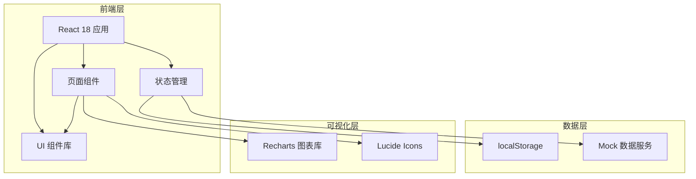
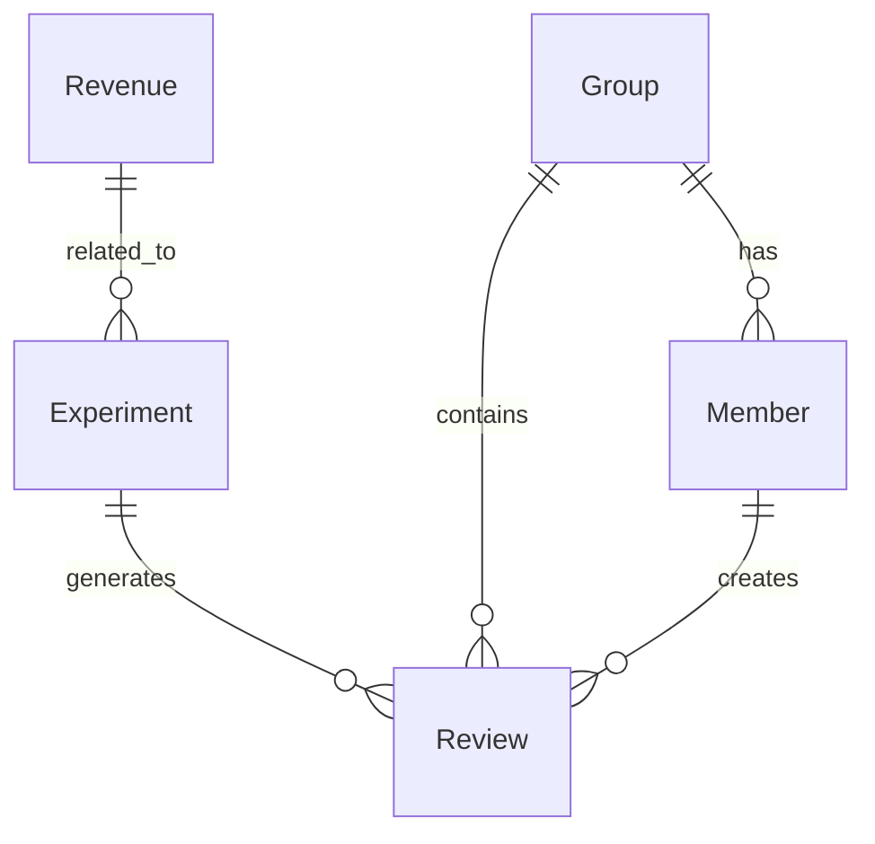

# 独立开发者收入复盘平台 - 技术架构文档

## 1. 架构设计



**架构说明：**
- 单页应用 (SPA)，基于 React Router 实现路由管理
- 组件化架构，页面与组件分离
- 状态管理使用 React Context + useReducer
- 数据持久化使用 localStorage
- Mock 数据模拟后端服务

## 2. 技术选型

| 类别 | 技术栈 | 版本 | 用途 |
|------|--------|------|------|
| 框架 | React | 18.2.0 | UI 框架 |
| 构建工具 | Vite | 5.0.0 | 快速构建 |
| 路由 | React Router DOM | 6.21.0 | 页面路由 |
| 样式 | Tailwind CSS | 3.4.0 | 原子化 CSS |
| 图表 | Recharts | 2.10.0 | 数据可视化 |
| 图标 | Lucide React | 0.303.0 | 图标库 |
| 日期 | date-fns | 3.0.0 | 日期处理 |
| UUID | uuid | 9.0.0 | ID 生成 |

## 3. 项目结构

```
src/
├── components/          # 通用组件
│   ├── ui/             # 基础 UI 组件
│   │   ├── Button.tsx
│   │   ├── Card.tsx
│   │   ├── Input.tsx
│   │   ├── Modal.tsx
│   │   └── Toast.tsx
│   ├── layout/         # 布局组件
│   │   ├── Sidebar.tsx
│   │   ├── Header.tsx
│   │   └── Layout.tsx
│   └── charts/         # 图表组件
│       ├── TrendChart.tsx
│       ├── PieChart.tsx
│       └── ProgressBar.tsx
├── pages/              # 页面组件
│   ├── Dashboard/
│   ├── Revenue/
│   ├── Experiments/
│   ├── Reviews/
│   └── Groups/
├── contexts/           # React Context
│   ├── AppContext.tsx
│   └── ThemeContext.tsx
├── hooks/              # 自定义 Hooks
│   ├── useLocalStorage.ts
│   └── useToast.ts
├── services/          # 数据服务
│   ├── mockData.ts
│   └── storage.ts
├── types/             # TypeScript 类型
│   └── index.ts
├── utils/             # 工具函数
│   ├── formatters.ts
│   └── validators.ts
├── App.tsx
├── main.tsx
└── index.css
```

## 4. 路由定义

| 路由 | 页面组件 | 路径参数 | 说明 |
|------|---------|---------|------|
| / | Dashboard | - | 仪表盘首页 |
| /revenue | Revenue | - | 收入流水页 |
| /revenue/add | RevenueAdd | - | 添加收入表单 |
| /experiments | Experiments | - | 实验记录页 |
| /experiments/:id | ExperimentDetail | id | 实验详情 |
| /reviews | Reviews | - | 复盘文章页 |
| /reviews/:id | ReviewDetail | id | 文章详情 |
| /reviews/new | ReviewEditor | - | 创建文章 |
| /groups | Groups | - | 同行小组页 |
| /groups/:id | GroupDetail | id | 小组详情 |

## 5. 数据模型定义

### 5.1 数据实体关系



### 5.2 TypeScript 类型定义

```typescript
// 收入记录
interface Revenue {
  id: string;
  amount: number;
  currency: 'CNY' | 'USD';
  date: string;
  product: string;
  productTag: string;
  type: 'subscription' | 'oneTime' | 'advertising';
  channel: 'appStore' | 'googlePlay' | 'website' | 'direct';
  experimentId?: string;
  note?: string;
  createdAt: string;
}

// 实验记录
interface Experiment {
  id: string;
  name: string;
  description: string;
  type: 'price' | 'channel' | 'feature';
  status: 'pending' | 'running' | 'completed';
  startDate: string;
  endDate?: string;
  targetMetric: string;
  targetValue: number;
  actualValue?: number;
  hypothesis: string;
  conclusion?: string;
  groupId?: string;
  createdBy: string;
  createdAt: string;
}

// 复盘文章
interface Review {
  id: string;
  title: string;
  content: string;
  type: 'note' | 'outline' | 'practice';
  tags: string[];
  visibility: 'private' | 'group';
  groupId?: string;
  authorId: string;
  experimentId?: string;
  likes: number;
  views: number;
  comments: Comment[];
  isBookmarked: boolean;
  isPendingValidation: boolean;
  createdAt: string;
  updatedAt: string;
}

// 点评
interface Comment {
  id: string;
  authorId: string;
  content: string;
  createdAt: string;
}

// 小组
interface Group {
  id: string;
  name: string;
  description: string;
  avatar?: string;
  members: Member[];
  nextReviewDate?: string;
  createdBy: string;
  createdAt: string;
}

// 成员
interface Member {
  id: string;
  name: string;
  email: string;
  avatar?: string;
  role: 'admin' | 'member';
}

// 用户
interface User {
  id: string;
  name: string;
  email: string;
  avatar?: string;
  groups: string[];
}
```

## 6. Mock 数据结构

### 6.1 示例收入数据

```typescript
const mockRevenues: Revenue[] = [
  {
    id: 'rev-001',
    amount: 299,
    currency: 'CNY',
    date: '2024-01-15',
    product: 'Pro工具箱',
    productTag: 'tool',
    type: 'subscription',
    channel: 'appStore',
    createdAt: '2024-01-15T10:30:00Z'
  },
  // ... 更多数据
];
```

### 6.2 示例实验数据

```typescript
const mockExperiments: Experiment[] = [
  {
    id: 'exp-001',
    name: '年订阅价格调整实验',
    description: '测试从¥199提高到¥299对转化率的影响',
    type: 'price',
    status: 'completed',
    startDate: '2024-01-01',
    endDate: '2024-01-15',
    targetMetric: '月收入增长率',
    targetValue: 20,
    actualValue: 35,
    hypothesis: '适度提价会提升用户对产品价值的感知',
    conclusion: '提价后转化率下降5%，但客单价提升使总收入增长35%',
    createdAt: '2024-01-01T00:00:00Z'
  }
];
```

## 7. 组件 API 设计

### 7.1 Card 组件

```typescript
interface CardProps {
  title?: string;
  children: React.ReactNode;
  className?: string;
  actions?: React.ReactNode;
}

// 使用示例
<Card 
  title="月度收入" 
  actions={<Button size="sm">详情</Button>}
>
  <p>¥45,280</p>
</Card>
```

### 7.2 Modal 组件

```typescript
interface ModalProps {
  isOpen: boolean;
  onClose: () => void;
  title?: string;
  children: React.ReactNode;
  footer?: React.ReactNode;
}
```

### 7.3 Toast 通知组件

```typescript
interface ToastProps {
  message: string;
  type?: 'success' | 'error' | 'info';
  duration?: number;
}

// 使用 Hook
const { showToast } = useToast();
showToast('保存成功', 'success');
```

## 8. 状态管理设计

### 8.1 App Context 结构

```typescript
interface AppState {
  user: User | null;
  revenues: Revenue[];
  experiments: Experiment[];
  reviews: Review[];
  groups: Group[];
  filters: {
    product: string[];
    type: string[];
    dateRange: [string, string];
  };
}
```

### 8.2 Reducer Actions

```typescript
type AppAction =
  | { type: 'ADD_REVENUE'; payload: Revenue }
  | { type: 'UPDATE_REVENUE'; payload: Revenue }
  | { type: 'DELETE_REVENUE'; payload: string }
  | { type: 'ADD_EXPERIMENT'; payload: Experiment }
  | { type: 'UPDATE_EXPERIMENT'; payload: Experiment }
  | { type: 'ADD_REVIEW'; payload: Review }
  | { type: 'TOGGLE_BOOKMARK'; payload: string }
  | { type: 'SET_FILTERS'; payload: Partial<FilterState> };
```

## 9. localStorage 数据持久化

### 9.1 存储键名

| 键名 | 数据类型 | 说明 |
|------|---------|------|
| revuedesk_revenues | Revenue[] | 收入记录 |
| revuedesk_experiments | Experiment[] | 实验记录 |
| revuedesk_reviews | Review[] | 复盘文章 |
| revuedesk_groups | Group[] | 小组数据 |
| revuedesk_user | User | 当前用户 |
| revuedesk_filters | FilterState | 筛选状态 |

### 9.2 数据同步策略

- 每次状态变更后自动同步到 localStorage
- 页面加载时从 localStorage 恢复数据
- 首次访问时使用 Mock 数据初始化

## 10. 性能优化策略

- React.memo 缓存纯展示组件
- useMemo 缓存计算属性（趋势数据、统计数据）
- 虚拟滚动优化长列表（收入流水表格）
- 图表组件懒加载
- 代码分割按路由拆分

## 11. 响应式断点

```css
/* 移动端优先 */
@media (min-width: 768px) { /* 平板 */ }
@media (min-width: 1024px) { /* 小桌面 */ }
@media (min-width: 1280px) { /* 大桌面 */ }
```

## 12. 可访问性 (A11y)

- 所有交互元素支持键盘导航
- 表单元素正确关联标签
- 颜色对比度符合 WCAG 2.1 AA 标准
- 图表提供文字替代描述
- 支持屏幕阅读器
